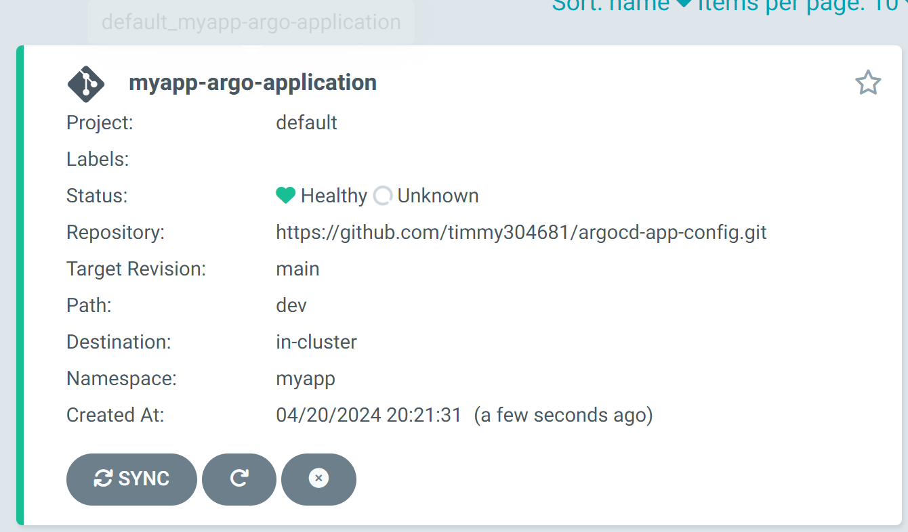
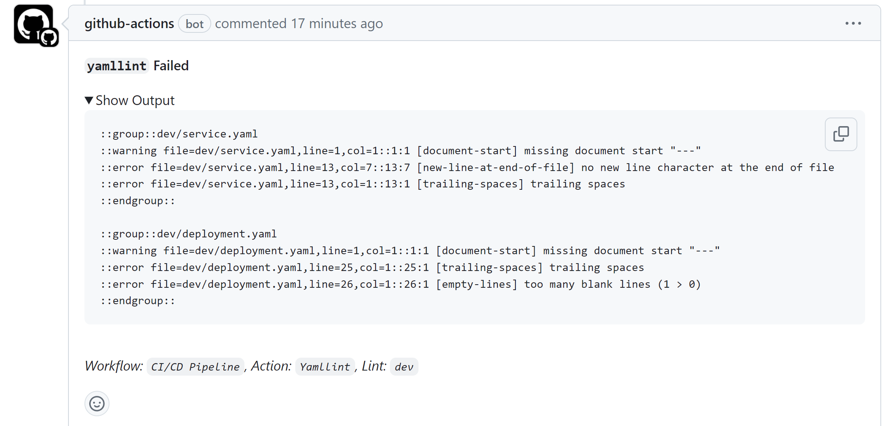
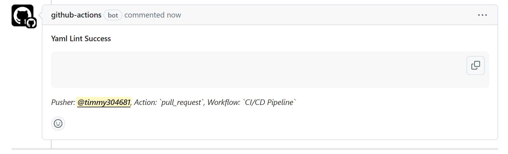
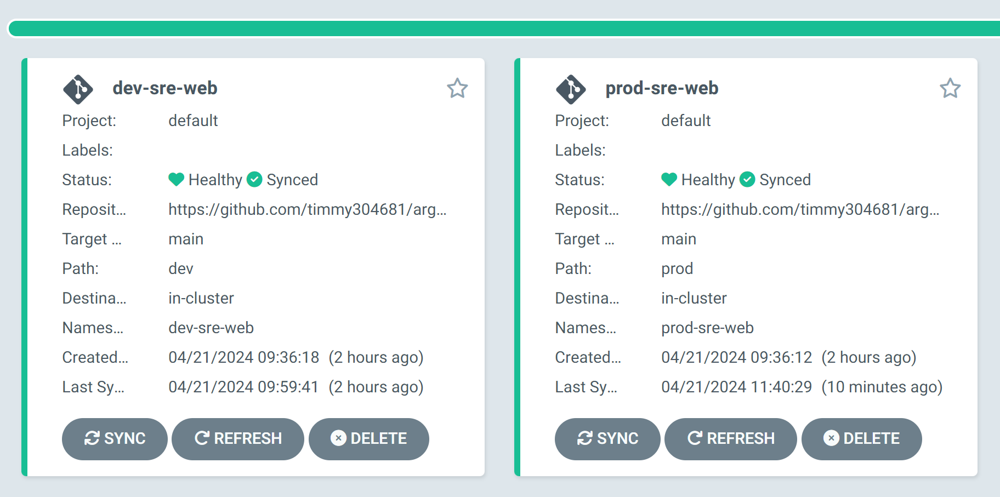
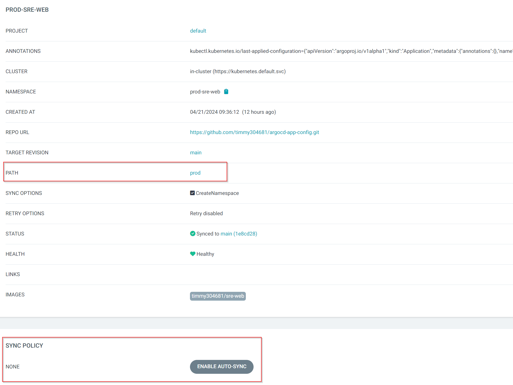
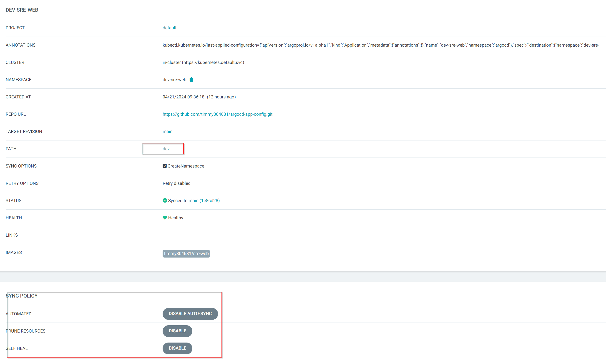
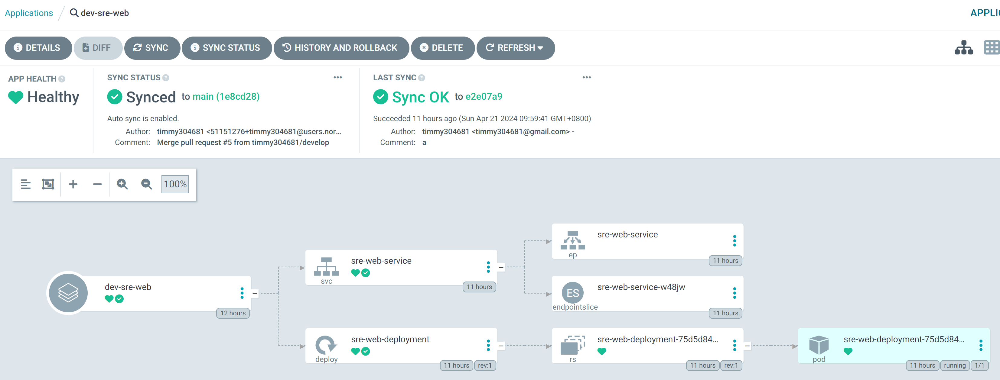
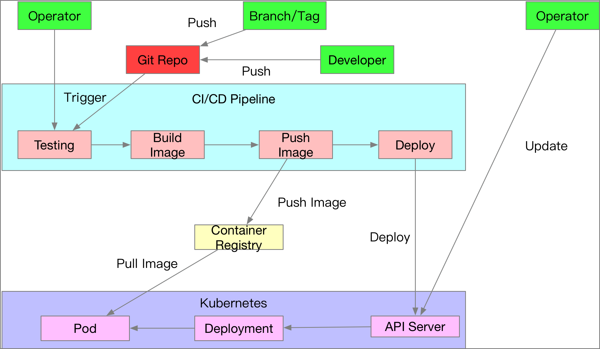
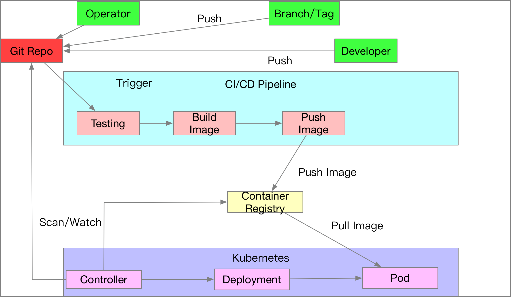

1. 於minikube安裝Argo CD
```
kubectl create namespace argocd
kubectl apply  -f https://raw.githubusercontent.com/argoproj/argo-cd/stable/manifests/install.yaml -n argocd

kubectl port-forward svc/argocd-server -n argocd 8080:443
```
2. 取得Argo CD帳號密碼[參考文章](https://argo-cd.readthedocs.io/en/stable/getting_started/#4-login-using-the-cli)，預設帳號為`admin`，可用argo CLI下`argocd admin initial-password`，或是用K8S指令取得，並decode base64。
```
#
yangtui@YangtuiPC:~/SRE-Program-Batch1$ kubectl get secrets argocd-initial-admin-secret -n argocd -o yaml
apiVersion: v1
data:
  password: aWJ6MzJaR0dqVDJDWEdhMA==
kind: Secret
metadata:
  creationTimestamp: "2024-04-20T09:43:21Z"
  name: argocd-initial-admin-secret
  namespace: default
  resourceVersion: "4992"
  uid: 54d6f178-f8a3-40aa-9270-90a0f59c3f35
type: Opaque

#
echo eG9ETmJJTG85bUEyWDhGOA== | base64 --decode 
xoDNbILo9mA2X8F8
```

3. 可以用UI建立`new app`，這邊用k8s yaml建立
```
apiVersion: argoproj.io/v1alpha1
kind: Application
metadata:
  name: myapp-argo-application
  namespace: argocd
spec:
  project: default

  source:
    repoURL: https://github.com/timmy304681/argocd-app-config.git
    targetRevision: main
    path: dev
  destination: 
    server: https://kubernetes.default.svc
    namespace: myapp

  syncPolicy:
    syncOptions:
    - CreateNamespace=true

    automated:
      selfHeal: true
      prune: true
```



# Github action workflow

k8s repository :https://github.com/timmy304681/argocd-app-config


1. push和pull_request皆會做k8s-lint和yaml lint檢查 ，CI URL: https://github.com/timmy304681/argocd-app-config/actions/runs/8769916068/job/24065909777
2. 若發出pull_request會觸發yaml lint檢查，若未通過，action會失敗且發comment通知失敗錯誤處，開發者可依內容修正，重新push

成功會印出如下，review人員就可merge

3. 為了實作方便設計兩個環境`dev` & `prod`，`dev`環境會偵測repository內`dev`folder，`prod`則偵測`prod`folder，
4. `prod`會關閉automated application synchronization，以確保repository的prod內資料異動，不會隨意自動被部屬





# Gitlab / github action 也是把部署檔案 git 化，那就是 gitops 了嗎？跟 ArgoCD 有什麼不同？
## CI/CD 部署
傳統的CI/CD 部署，觸發條件會是pull request被merge等一些條件，會觸發後續pipeline，讓Gitlab / github action 能直接對 Kubernetes Cluster 進行操控，但有幾個大問題是:
1. 並沒有辦法控管 Kubernetes 正在運行的資源狀態 
2. 對於k8s cluster來說，Gitlab / github action 都是屬於第三方部屬，因此需要有KUBECONFIG (如token)的散佈
3. k8s cluster的連線資訊就會被暴露在外
4. 因為只要token暴露在外，就難以確保 k8s 內運行的狀態與描述的資源檔案 (Yaml/Helm Chart) 一致


## GitOps
GitOps就是想解決以上傳統CI/CD 部署的問題:
1. CI/CD Pipeline 內不進行任何部署動作，而是由ArgoCD去偵測git變化，
2. k8s的token不需外流，只要不外流就沒有其他途徑可以更動k8s
3. 代表開發人員能對k8s有異動，唯一途徑就必須要異動git，就能有版本控制保障


# 參考:
https://www.hwchiu.com/docs/2020/gitops